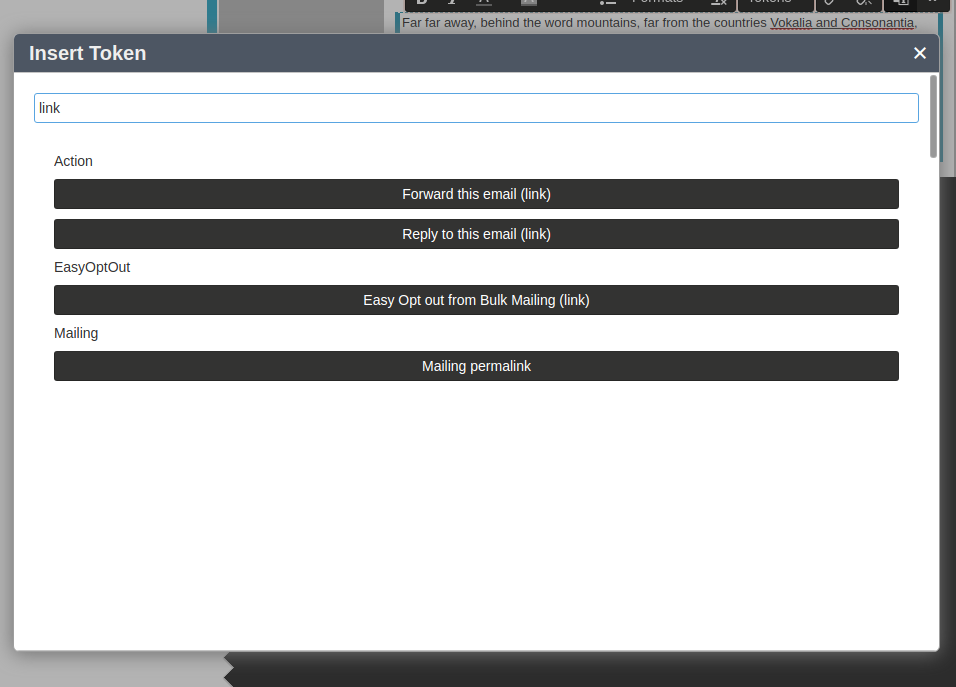
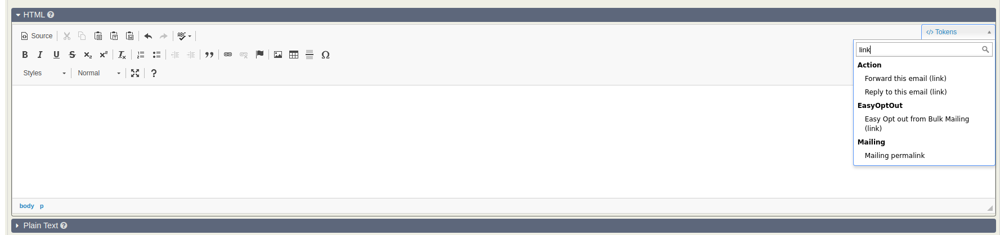

# easy-opt-out

**THIS REPO IS ARCHIVED!**

[](https://github.com/reflexive-communications/easy-opt-out/actions/workflows/main.yml)

This extension provides an email token, that is replaced with a link to a page that processes a custom opt-out flow. The token works with Mosaico and with traditional mailer also. It provides the following opt-out flow.
The token is replaced with a link to the opt-out page. When the page is visited, it validates the query string parameters and in case of successful validation it sets the contact `is_opt_out` flag to 1, that means the user will be excluded from the bulk mailings. After the successful opt-out, the contact email is displayed on the page with success info text.

The extension is licensed under [AGPL-3.0](LICENSE.txt).

**The token in Mosaico**


**The token in traditional**


## Requirements

-   PHP v7.3+
-   CiviCRM 5.37.1+
-   FlexMailer

## Installation (CLI, Git)

Sysadmins and developers may clone the [Git](https://en.wikipedia.org/wiki/Git) repo for this extension and
install it with the command-line tool [cv](https://github.com/civicrm/cv).

```bash
git clone git@github.com:reflexive-communications/easy-opt-out.git
cv en easy-opt-out
```
